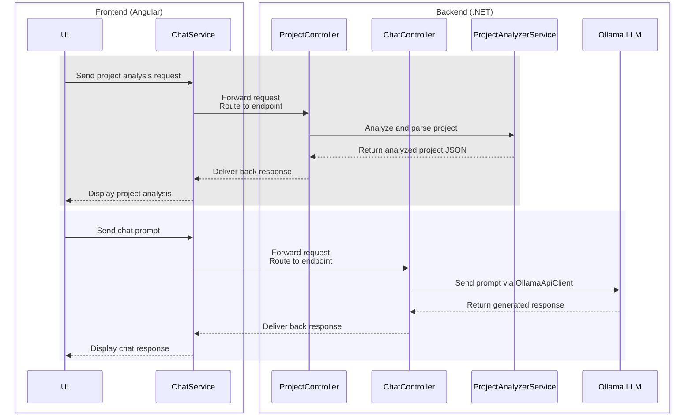

# Local Chatbot for Project Analysis

This project is a **local chatbot application** that uses a local LLM (via OllamaSharp) to analyze and explain software projects (Angular and .NET) in natural language. It allows developers to interactively ask questions about a codebase or perform general-purpose chat queries.

---

## Table of Contents

- [Features](#features)  
- [Requirements](#requirements)  
- [Installation](#installation)  
- [Usage](#usage)  
- [Project Workflow](#project-workflow)  
- [Notes & Limitations](#notes--limitations)  

---

## Features

- Load a project folder (Angular or .NET) and parse all source code files.
- Analyze components, services, modules, controllers, and interfaces.
- Interact with the project through natural language queries.
- Toggle between **Project Context Mode** and **General Chat Mode**.
- Local-only processing using Ollama LLM (no external API calls).
- Real-time chat interface with history and scrollable messages.
- Clear or reset chat functionality.

---

## Requirements

- **.NET 8 SDK**  
- **Angular 20** (standalone components used)  
- **Ollama desktop client** with a compatible LLM installed (this project is using: llama3.2)  
- **Node.js 20+**  
- Modern browser (Chrome, Edge, etc.)  

Optional: GPU is recommended for faster LLM response times.

---

## Installation

1. **Clone the repository**  
   ```
   git clone <repository-url>
   cd <repository-folder>
2. **Install Angular dependencies**  
   ```
   cd Client
   npm Install
3. **Restore .NET dependencies**  
   ```
   cd ../API/LocalChatBotBackend
   dotnet restore
4. **Start Ollama local server** 
    
    Ensure Ollama desktop is running, or start the server manually: 
   ```
   ollama serve
   ```
   Confirm the server is running at http://localhost:11434.
5. **Run the .NET backend** 

   ```
   dotnet run --project Server/LocalChatBotBackend.csproj
   ```
   By default, it should listen at http://localhost:5057.
6. **Run the Angular frontend** 

   ```
   ng serve
   ```
   Navigate to http://localhost:4200 in your browser.

---

## Usage

1. Load a Project

    - Toggle Use Project Context to enable project analysis.

    - Enter the project folder path and select the type (Angular or .NET).

    - Click Load Project. A message confirms successful loading.

2. Ask Questions

    - Type a message in the input box.

    - Press Enter or click Send.

    - Responses will be generated by the local LLM.

3. General Chat Mode

    - Uncheck Use Project Context to ask general questions (weather, date, etc.).

4. Clear Chat

    - Click Clear to reset the conversation.

---

## Project Workflow

1. Frontend (Angular)

    - Handles user input, messages, and toggles.

    - Sends project path/type or chat queries to the backend via HTTP requests.

2. Backend (.NET)

    - ProjectController - handles project analysis, parsing all code files for components, services, modules, controllers, and interfaces.

    - ChatController - handles chat queries, sending prompts to the local LLM (via OllamaSharp) and returning responses.

    - ProjectAnalyzerService - performs deep analysis / parsing of Angular and .NET project contents.

3. LLM Integration

    - Prompts are constructed dynamically based on Project Context Mode.
    - The LLM analyzes the full project source code or responds to general queries.

4. Visual Flow Diagram



## Notes & Limitations

- Currently supports Angular and .NET projects only.

- All source code must reside on the local machine; remote paths are not supported.

- Performance depends on the size of the project and your local LLM capabilities.

- For large projects, consider batching or partial folder uploads.

- Ensure that project folders are accessible (no restricted permissions).
